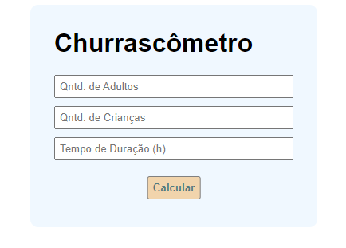
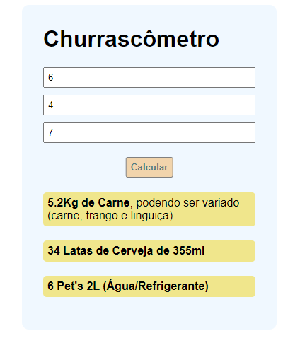

<h1 align="center">
 Churrascômetro
</h1>

  <a href="#-project">Project</a>&nbsp;&nbsp;&nbsp;|&nbsp;&nbsp;&nbsp;
  <a href="#-technologies">Technologies</a>&nbsp;&nbsp;&nbsp;|&nbsp;&nbsp;&nbsp;
  <a href="#-services-used">Services Used</a>&nbsp;&nbsp;&nbsp;|&nbsp;&nbsp;&nbsp;
  <a href="#-getting-started">Getting Started</a>&nbsp;&nbsp;&nbsp;|&nbsp;&nbsp;&nbsp;
  <a href="#-how-to-use">How To Use</a>&nbsp;&nbsp;&nbsp;|&nbsp;&nbsp;&nbsp;
  <a href="#-features">Features</a>&nbsp;&nbsp;&nbsp;

 

 

  

## 💻 Project

"Churrascômetro" is a project developed at the end of the study about JS intermediate. This project aims to calculate the amount of meat and drinks needed for a barbecue, based on the duration of the event.

<!-- **Important note about the project:**

The duration influences values below 6 and + = (greater than or equal to) 6.

Example: The consumption of food / drinks for 1 hour will be the same for 4 hours; The same is true when working with values above 6.
Work will be made to fix this.  -->

This application is hosted on GitHub Pages, [click here to see it](https://deywersonp.github.io/churrascometro-project/).
  

## 🚀 Technologies

This project was developed using these techs:

- [HTML](https://developer.mozilla.org/pt-BR/docs/Web/HTML)
- [CSS](https://developer.mozilla.org/pt-BR/docs/Web/CSS)
- [JavaScript](https://developer.mozilla.org/pt-BR/docs/Web/JavaScript)

 

## 👨‍🔧 Services Used
- GitHub
- [GitHub Pages](https://pages.github.com/)

 

## 🎮 Getting Started

If you want run this code, you can start cloning the repository using HTTP or SSH key.

- Open your git
- Type `git clone`
- Insert the HTTP or SSH key (on windows, shift + insert to paste on gitBash)
- You can find this HTTP or SSH Key by clicking on `Code` on the top right in this repository

- Once cloned you can open the project in your IDE and open the archive `index.html` on your browser.

  

## 📌 How to Use

### 1 - When you access the project, you will see the home page

### 2 - On this page you can enter the number of people and the duration of the event. When clicking on calculate the result is printed on screen.

### 3 - Write down the information obtained and have an excellent barbecue!

 

## 🕵 Features

The main features of the application are:
 - Calculate the amount of meat and drinks needed for a barbecue
 
 

 > In case of sensitive bugs like security vulnerabilities, please contact
 > <a href = "mailto:deywerson.pereira@gmail.com">deywerson.pereira@gmail.com</a> directly instead of using issue tracker. We value your effort
 > to improve the security and privacy of this project!
  
 
---
  

      
Please follow on github and join us! Thanks for visiting me and good coding!

Made with ♥ by <a href="https://github.com/deywersonp">Deywerson Pereira</a>
